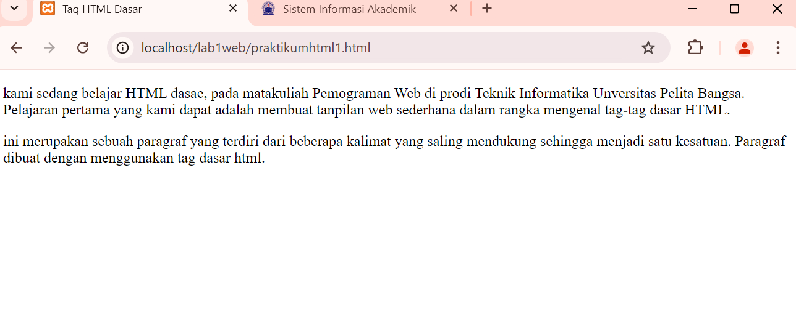
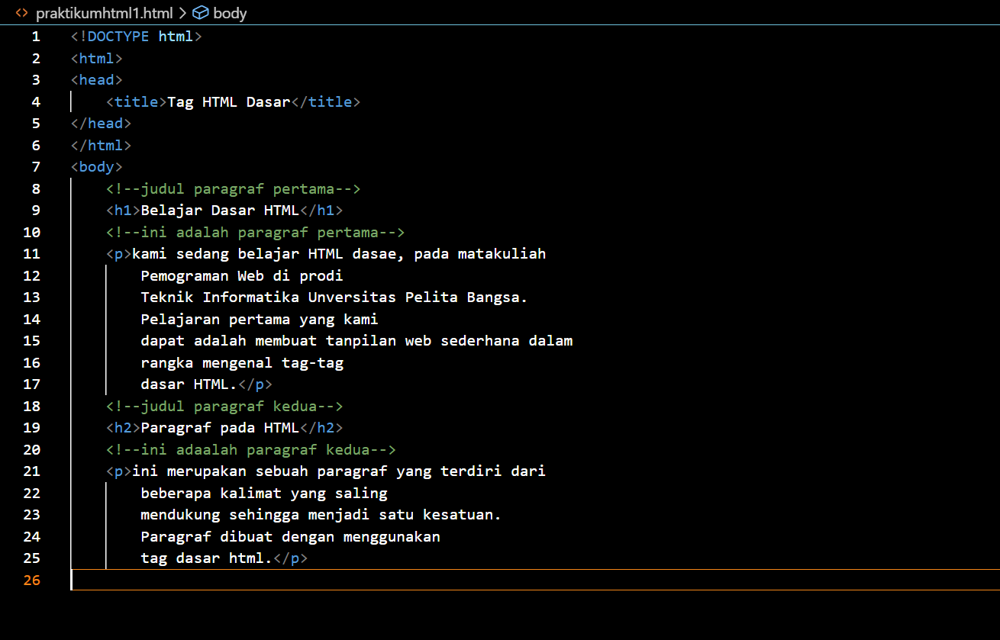
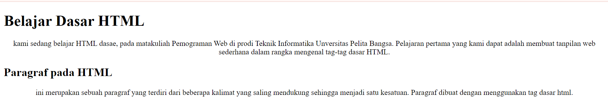
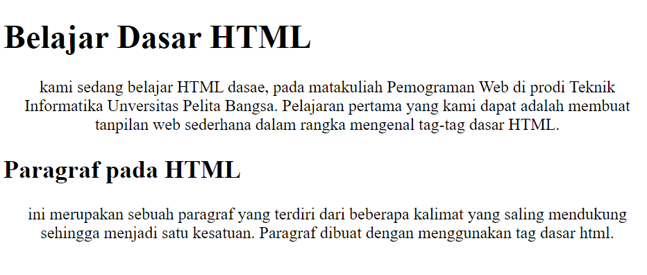
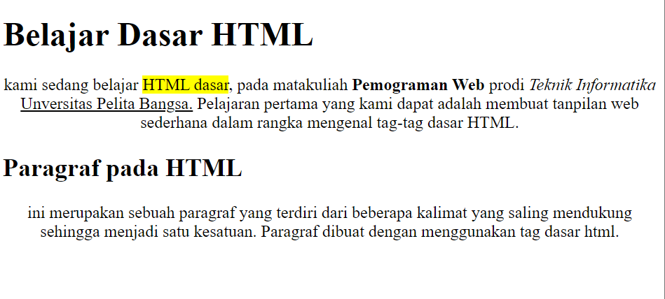
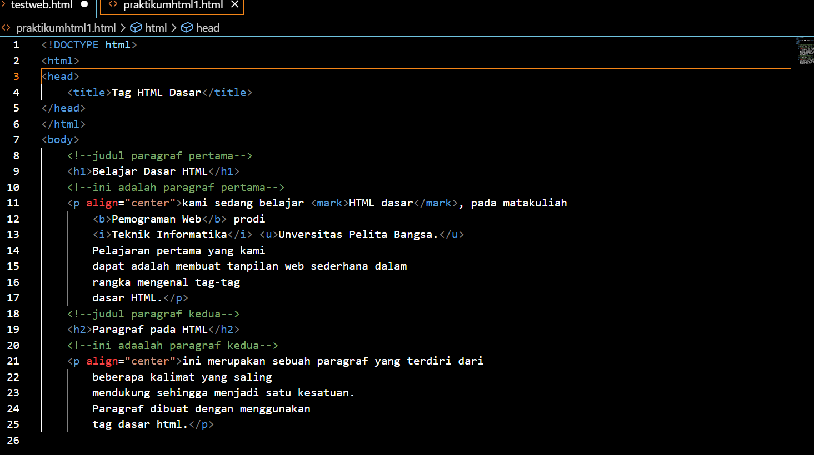

# lab-1web

## 1. Menambahkan file baru praktikum1 dan menambahkan tag dasar dokumen HTML.
- Gambar 1

## 2. Kemudian atur atribut paragraf dan menambahkan sub judul
- Gambar result

## 3. Format teks pada paragraf
- Gambar result

## 4. Kemudia menyisipkan gambar pada halaman web dan menambahkan judul
- Gambar result

## 5. Menambahkan Hyperlink pada dokumen tersebut
- Gambar 1

- Gambar 2

