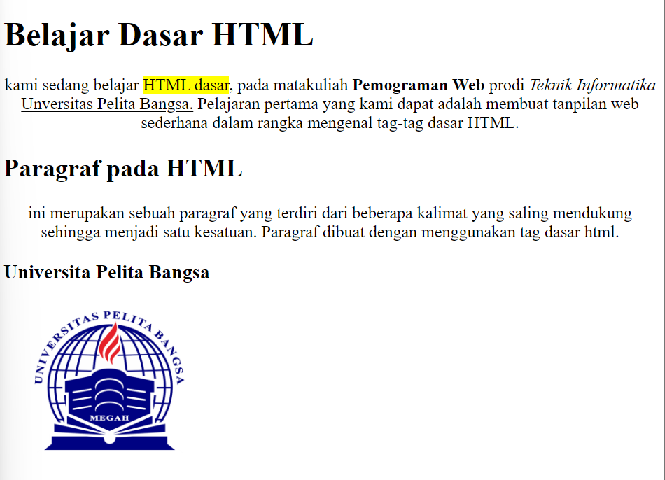
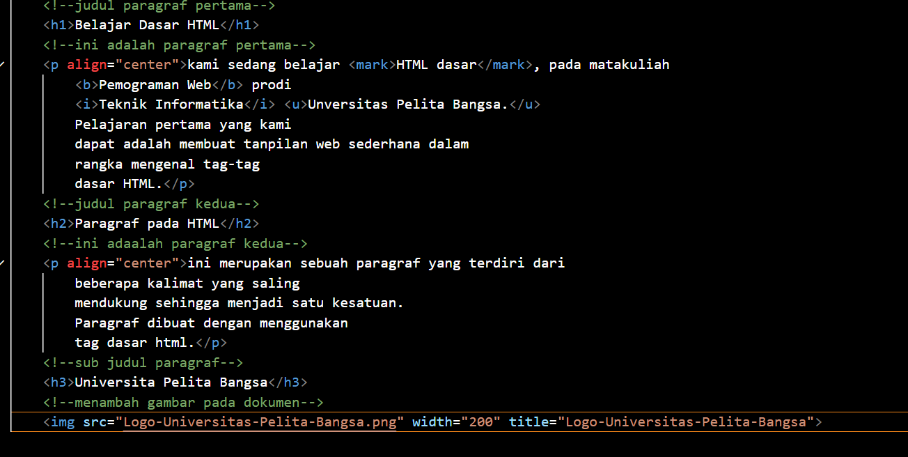
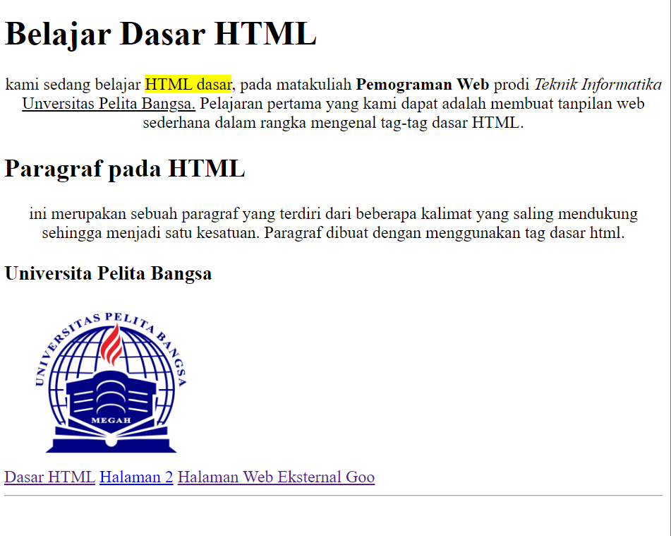
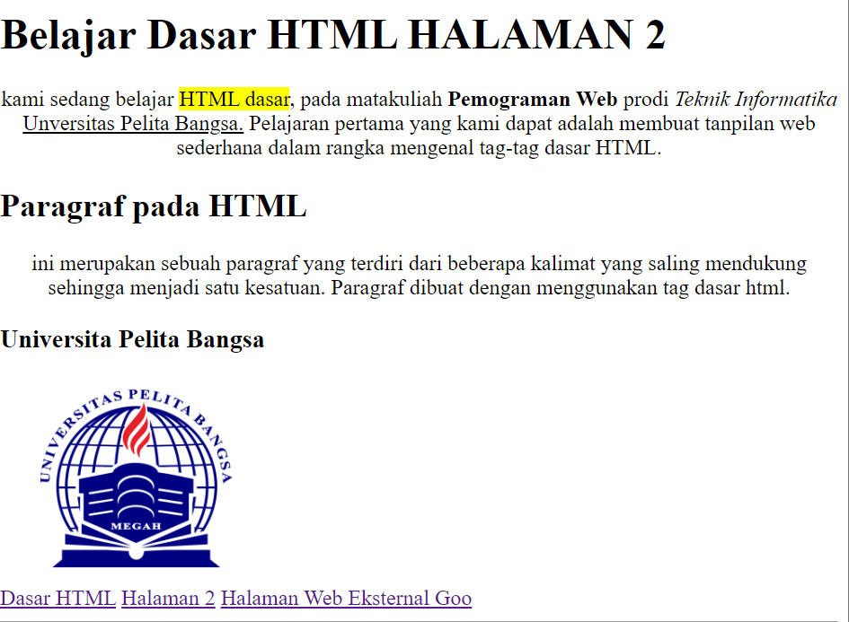
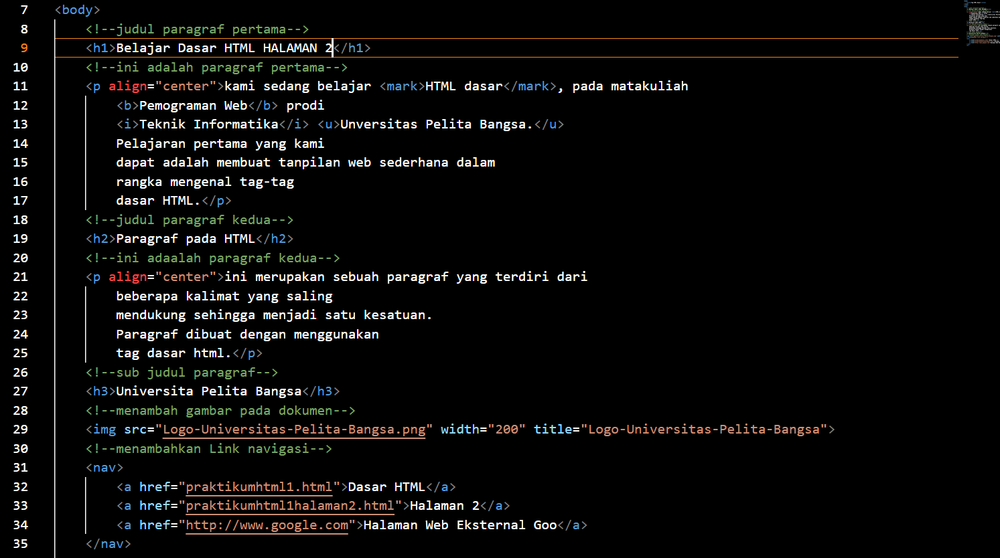

# lab-1web
## Nama = Azzahra Nabiila
## Nim = 312310367
## Kelas = TI.23.A4
## 1. Membuat paragraf sederhana.
- Gambar

## 2. Kemudian atur atribut paragraf dan menambahkan sub judul.
- Gambar

- Gambar

- Gambar

## 3. Format teks pada paragraf.
- Gambar 

## 4. Kemudian menyisipkan gambar pada halaman web dan menambahkan judul.

## 5. Menambahkan Hyperlink pada dokumen terserbut.

 hal 2
